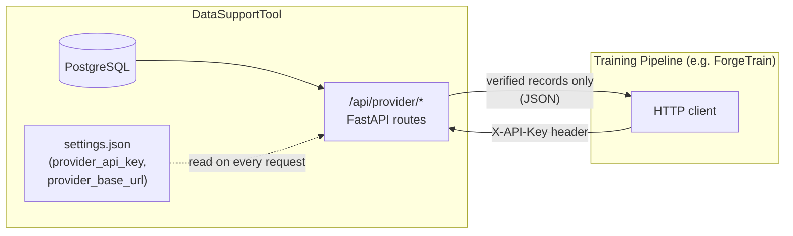
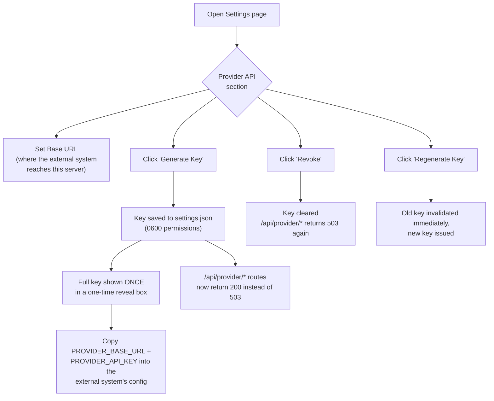
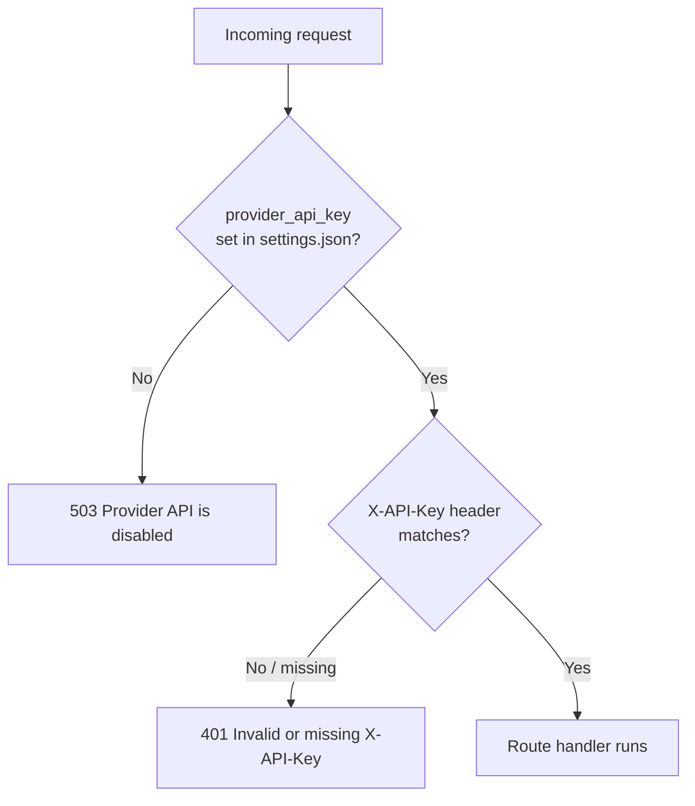

# Provider API — Training Pipeline Integration

This document covers the `/api/provider/*` and `/api/settings/provider*` routes that let an external system (e.g. a training/inference pipeline such as ForgeTrain) pull verified data out of DataSupportTool over HTTP.

DataSupportTool is the **dataset provider**. The external system is expected to act as the **inferencing/training machine** — it generates its own model outputs; this API does not ship pre-filled answers for training rows.

---

## 1. Overview



Key design decisions:

- **Verification, not full completion, is the export bar.** A dataset never has to be 100% finished to export — each endpoint filters to only the records that individually passed their own verification checkpoint and silently drops the rest. Re-polling the same URL later returns more records as more get verified.
- **The API key lives in `settings.json`, not `.env`.** It's generated/rotated from the Settings page and takes effect immediately on the next request — no server restart.
- **Closed by default.** Until a key has been generated, every `/api/provider/*` route returns `503`.

---

## 2. Enabling the API (Settings page)



Steps:
1. Go to **Settings → 🔌 Provider API (Training Pipeline Integration)**.
2. Enter the **Base URL** the external system will use to reach this server (e.g. `http://localhost:8000`, or a tunnel/public hostname if it runs elsewhere) and click **Save**.
3. Click **Generate Key**. The full key is displayed once, in a copyable `PROVIDER_BASE_URL=…` / `PROVIDER_API_KEY=…` block — copy it now, it is never shown in full again (only a masked `first4…last4` form).
4. Paste both values into the external system's configuration.
5. **Regenerate Key** rotates it (old key stops working immediately); **Revoke** disables the API entirely (`503` on every route until a new key is generated).

---

## 3. Authentication

Every `/api/provider/*` route requires:

```
X-API-Key: <the key from Settings>
```



| Condition | Response |
|---|---|
| No key generated yet | `503 {"detail": "Provider API is disabled. Generate a key from Settings to enable external access."}` |
| Missing/wrong `X-API-Key` | `401 {"detail": "Invalid or missing X-API-Key header"}` |
| Valid key | Request proceeds |

---

## 4. Verification / gating model

Each data source has its own definition of "verified," computed live from record-level state on every request — never from a cached status flag (those were found to go stale in practice).

```mermaid
flowchart TD
    subgraph Text["Text dataset export"]
        T1["TextRecord"] --> T2["BR Pipeline\nStage 1: Classification"]
        T2 --> T3["Stage 2: Restructure"]
        T3 --> T4["Stage 3: Question\nValidation (human picks\none of 3 questions)"]
        T4 -->|"selected_question_index\nis not null"| T5(["✅ Exportable"])
        T4 -.->|"not yet validated"| T6(["excluded from export"])
        T5 -.-> T7["Stage 5: Model Responses\n(NOT required — own\noutput-checking only)"]
    end

    subgraph ASR["ASR dataset export"]
        A1["AudioFile"] --> A2{"status =\nCOMPLETED?"}
        A2 -- Yes --> A3(["✅ Exportable"])
        A2 -- No --> A4(["excluded"])
    end

    subgraph BR["BR pipeline export\n(own-use / output-checking)"]
        B1["BRRecordStage"] --> B2{"completed = True\n(finished Stage 5)?"}
        B2 -- Yes --> B3(["✅ Exportable"])
        B2 -- No --> B4(["excluded"])
    end
```



| Source | Verification checkpoint | Field checked |
|---|---|---|
| Text export (`/text/{id}/export`) | BR pipeline **Stage 3** — human approved a generated question | `BRRecordStage.selected_question_index IS NOT NULL` |
| ASR export (`/asr/{id}/export`) | Transcript fully corrected | `AudioFile.status == COMPLETED` |
| BR pipeline export (`/br-pipeline/{run_id}/export`) | Finished **Stage 5** (model responses generated) | `BRRecordStage.completed == True` |

Why Stage 3, not Stage 5, gates the **text** export: Stage 5 (model responses) is DataSupportTool's own internal output-checking step. The training pipeline generates its own answers, so it only needs a human-validated question + context — it doesn't need or wait for DataSupportTool to have already run inference.

---

## 5. API Reference

Base path: `/api/provider` (all routes require the `X-API-Key` header described above, except where noted).

### 5.1 `GET /api/provider/datasets`

Discovery/inventory. Lists every text dataset, ASR dataset, and BR pipeline run with counts of currently-verified records.

**Response**
```json
{
  "datasets": [
    {
      "source": "text",
      "id": 20,
      "name": "Cleanned",
      "total_records": 1000,
      "verified_records": 665,
      "ready": true,
      "export_url": "/api/provider/text/20/export"
    },
    {
      "source": "asr",
      "id": 4,
      "name": "KeluarSekejap",
      "total_records": 549,
      "verified_records": 0,
      "ready": false,
      "export_url": "/api/provider/asr/4/export"
    },
    {
      "source": "br_pipeline",
      "id": 6,
      "name": "BR Pipeline Run #6 (dataset 20)",
      "dataset_id": 20,
      "total_records": 665,
      "verified_records": 665,
      "ready": true,
      "export_url": "/api/provider/br-pipeline/6/export"
    }
  ],
  "total": 19
}
```
`ready: true` means `verified_records > 0` — not that the dataset is 100% finished.

---

### 5.2 `GET /api/provider/text/{dataset_id}/export?format={alpaca|gemma|sharegpt}`

**Primary training-data endpoint.** Exports Stage-3-validated question/context pairs in the requested template. `output`/the assistant turn is always left blank — the training pipeline fills it in.

| Query param | Values | Default |
|---|---|---|
| `format` | `alpaca`, `gemma`, `sharegpt` | `sharegpt` |

**Response envelope**
```json
{
  "dataset_id": 20,
  "dataset_name": "Cleanned",
  "format": "sharegpt",
  "exported_at": "2026-07-14T09:31:00.123456+00:00",
  "record_count": 771,
  "records": [ /* shape depends on format, see below */ ]
}
```

**Record shape by template**

| Template | Shape |
|---|---|
| `alpaca` | `{"instruction": "<validated question>", "input": "<context text>", "output": ""}` |
| `gemma` | `{"text": "<start_of_turn>user\n{context}\n\n{question}<end_of_turn>\n<start_of_turn>model\n<end_of_turn>"}` |
| `sharegpt` | `{"conversations": [{"from": "human", "value": "{context}\n\n{question}"}, {"from": "gpt", "value": ""}]}` |

`404` if `dataset_id` doesn't exist. Never `409`s — an empty `records: []` just means nothing has passed Stage 3 yet.

---

### 5.3 `GET /api/provider/asr/{dataset_id}/export`

Exports finished ASR transcripts (`status == COMPLETED` files only).

**Response**
```json
{
  "dataset_id": 4,
  "dataset_name": "KeluarSekejap",
  "exported_at": "2026-07-14T09:31:00.123456+00:00",
  "record_count": 12,
  "records": [
    {
      "id": 101,
      "filename": "clip.wav",
      "duration": 8.2,
      "transcript": "...",
      "audio_url": "/api/provider/asr/files/101/audio"
    }
  ]
}
```

### 5.4 `GET /api/provider/asr/files/{file_id}/audio`

Streams the raw audio bytes for one completed file. `409` if the file isn't `COMPLETED`, `404` if missing on disk.

---

### 5.5 `GET /api/provider/br-pipeline/{pipeline_run_id}/export`

**Not for training input.** Exposes DataSupportTool's own Stage-5 output (question + the model responses DataSupportTool generated per model), for comparing your own inference output against DataSupportTool's — output-checking/eval use, not ground truth.

**Response**
```json
{
  "pipeline_run_id": 6,
  "dataset_id": 20,
  "exported_at": "2026-07-14T09:31:00.123456+00:00",
  "record_count": 665,
  "records": [
    {
      "record_id": 16391,
      "text": "...",
      "question": "...",
      "model_responses": {
        "Model-A (hf.co/aisingapore/...)": {
          "model_id": "hf.co/aisingapore/...",
          "response": "...",
          "problems": []
        }
      }
    }
  ]
}
```

---

### 5.6 Settings endpoints (internal — not API-key gated)

These configure the provider API itself and are only reachable from the DataSupportTool UI/backend (same trust level as the rest of `/api/settings/*`, which has no auth).

| Method | Path | Purpose |
|---|---|---|
| `GET` | `/api/settings/provider` | `{"enabled": bool, "masked_key": "a333…ab15" \| null, "provider_base_url": str}` |
| `PUT` | `/api/settings/provider` | Body `{"provider_base_url": str}` — updates the displayed base URL |
| `POST` | `/api/settings/provider/generate-key` | Generates/rotates the key. Returns `{"provider_api_key": "<full key, once>", "provider_base_url": str}` |
| `DELETE` | `/api/settings/provider/key` | Clears the key — disables the whole provider API (`503` afterwards) |

---

## 6. Quick smoke test

```bash
BASE=http://localhost:8000
KEY=<key from Settings>

curl -s -H "X-API-Key: $KEY" "$BASE/api/provider/datasets" | jq
curl -s -H "X-API-Key: $KEY" "$BASE/api/provider/text/20/export?format=sharegpt" | jq '.records[0]'
```

---

## 7. Security notes

- `settings.json` holds `provider_api_key` in plaintext. It is written with **`0600`** permissions (`save_settings()` in `backend/routes/settings.py`), and `load_settings()` tightens the mode on every read if it's ever found broader than `0600`.
- `settings.json` is **gitignored** — a secret-free `settings.example.json` documents the schema instead. If you're setting up a new environment, copy it: `cp settings.example.json settings.json`.
- Treat the full key as compromised the moment it's displayed anywhere it could be logged or shared (chat transcripts, screen shares, tickets) — regenerate it from Settings rather than reusing an exposed value.
- The provider API is unauthenticated-by-default in the sense that `/api/settings/*` (where the key itself is managed) has no auth of its own — it assumes the same trust boundary as the rest of the DataSupportTool app (internal network / trusted operator). Don't expose the DataSupportTool UI itself to an untrusted network without adding auth in front of it.

---

## 8. Known limitations / not yet built

- **No pagination** on export endpoints — the full current verified set returns in one response. Fine at hundreds/low-thousands of rows (tested against 771 real records); revisit with `?limit=&offset=` if a dataset gets very large.
- **Pull-only, no webhook** — the training pipeline must poll `GET /api/provider/datasets` to notice new verified records; DataSupportTool doesn't push notifications.
- **No write-back path** — there's no API for the training pipeline to push its generated outputs or eval results back into DataSupportTool. Would need a new endpoint if a closed loop is required.
